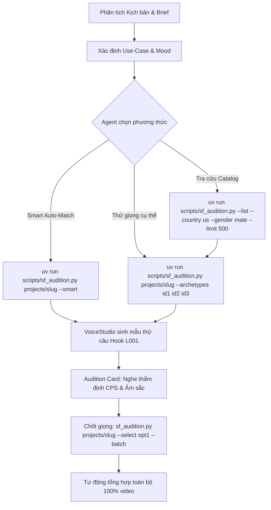

# Hướng Dẫn Kỹ Thuật: Smart Voice Casting & Tra Cứu VoiceStudio

Tài liệu này cung cấp toàn bộ kiến trúc API, taxonomy và phương pháp tuyển chọn giọng nói thông minh từ VoiceStudio cho StoryForge Agent.

---

## 1. Bản Đồ Năng Lực Của VoiceStudio (Catalog & Capabilities)

VoiceStudio cung cấp **1.126 Archetypes** được thiết kế sẵn và khả năng tổng hợp âm thanh trên **646 ngôn ngữ** (bao gồm tiếng Việt `vi`, tiếng Anh `en`, tiếng Trung `zh`, tiếng Tây Ban Nha `es`, v.v.).

### Cấu trúc dữ liệu của 1 Archetype:
Mỗi giọng mang các trường dữ liệu:
- `id`: Mã định danh duy nhất (ví dụ: `feat_01_the_documentarian`, `feat_03_the_storyteller`, `a_44baa4fbb0`).
- `name`: Tên nghệ danh (ví dụ: *The Documentarian*, *The Calm Guide*, *American · Male · Middle-Aged · Low*).
- `use_case`: 1 trong 7 thể loại ứng dụng cốt lõi.
- `instruct`: Chuỗi tokens quy định âm sắc cơ sinh học (`gender, age, pitch, accent/dialect, style`).
- `attrs`: Dict các trục điều khiển của bộ tạo âm thanh.
- `facets`: Trường trích xuất nhanh để lọc (`gender`, `age`, `pitch`, `accent`, `whisper`, `lang`).
- `sample_script`: Câu thoại mẫu thử nghiệm.
- `is_featured`: Đánh dấu giọng cao cấp được tinh chỉnh (51 giọng).

---

## 2. Hệ Thống 7 Thể Loại Cốt Lõi (Use-Cases)

| Use-Case ID | Tên Thể Loại | Ứng Dụng Phù Hợp Trong Sản Xuất Video | Ví Dụ Archetype |
| :--- | :--- | :--- | :--- |
| `narration` | **Narration & Story** | Kể chuyện, sách nói, tài liệu khám phá, lịch sử, kỳ bí, khoa học nhận thức, tự sự. | `feat_01_the_documentarian`, `feat_03_the_storyteller`, `feat_02_the_calm_guide` |
| `informative` | **Informative & Educational** | Phân tích tài chính, bóc phốt kinh tế, kiến thức công nghệ, bài giảng, tin tức. | `feat_22_the_teacher`, `feat_23_the_explainer` |
| `conversational` | **Conversational** | Podcast tâm sự, đối thoại bạn bè, tư vấn đời sống, phỏng vấn thực tế. | `feat_04_the_neighbor`, `feat_06_the_mate` |
| `social` | **Social Media** | Shorts / TikTok / Reels sôi động, vlogger năng lượng cao, review trải nghiệm. | `feat_13_the_podcaster`, `feat_14_the_hype_host`, `feat_15_the_vlogger` |
| `entertainment` | **Entertainment & TV** | Gameshow, MC bình luận thể thao, tin giải trí, lôi cuốn khán giả. | `feat_16_the_anchor`, `feat_17_the_commentator` |
| `advertisement` | **Advertisement** | TVC quảng cáo, giới thiệu sản phẩm cao cấp (luxury), kích thích mua sắm. | `feat_19_the_promo_voice`, `feat_20_the_luxe` |
| `characters` | **Characters & Animation** | Lồng tiếng nhân vật hoạt hình, phim, game, kịch tính cao, lão làng, quái vật. | `feat_08_captain_crusty`, `feat_11_the_pixie` |

---

## 3. Các Trục Lọc Đa Chiều (Multi-Facet Filter Matrix)

### A. Quốc gia & Chất giọng (Country / Accent)
VoiceStudio hỗ trợ 10 chất giọng vùng miền chuẩn quốc tế:
- `us` / `american accent`: Giọng chuẩn Bắc Mỹ (Mỹ).
- `uk` / `british accent`: Giọng đĩnh đạc hoàng gia (Anh).
- `au` / `australian accent`: Giọng tự nhiên, phóng khoáng (Úc).
- `ca` / `canadian accent`: Giọng truyền cảm nhẹ nhàng (Canada).
- `cn` / `chinese accent` & 12 phương ngôn (Tứ Xuyên, Hà Nam, Thiểm Tây, v.v.).
- `in` / `indian accent`: Giọng đàm thoại công nghệ (Ấn Độ).
- `jp` / `japanese accent`: Giọng Nhật Bản.
- `kr` / `korean accent`: Giọng Hàn Quốc.
- `br` / `pt` / `portuguese accent`: Bồ Đào Nha / Brazil.
- `ru` / `russian accent`: Nga.

### B. Giới tính (Gender)
- `male`: Nam.
- `female`: Nữ.

### C. Độ tuổi sinh học (Age)
- `child`: Trẻ em (phù hợp hoạt hình, nhân vật phụ).
- `teenager`: Thiếu niên (phù hợp kênh học đường, review giới trẻ).
- `young adult`: Thanh niên 20–35 (phù hợp podcast, tech, mạng xã hội).
- `middle-aged`: Trung niên 35–55 (chuẩn tài liệu, tin tức, khoa học, thẩm quyền).
- `elderly`: Lớn tuổi 55+ (người kể chuyện thông thái, lịch sử, cổ tích).

### D. Cao độ âm vực (Pitch)
- `very low pitch` / `very-low`: Cực trầm, uy nghiêm, điện ảnh, kỳ bí.
- `low pitch` / `low`: Trầm ấm, điềm đạm, tin cậy, tự sự sâu sắc.
- `moderate pitch` / `moderate`: Tự nhiên, đàm thoại, rõ ràng, dứt khoát.
- `high pitch` / `high`: Tươi sáng, năng động, nhiệt huyết.
- `very high pitch` / `very-high`: Rất cao, hoạt họa, tí hon.

### E. Phong cách đặc biệt (Style)
- `whisper`: Thì thầm, ASMR, hồi hộp, bí mật, kịch tính ngầm.

---

## 4. Phương Pháp Tuyển Chọn Giọng Thông Minh (Smart Voice Selection Workflow)

### Thuật toán chấm điểm tự động (4-Tier Smart Voice Selection Hierarchy):
Khi kích hoạt `--smart`, hệ thống tuân thủ nghiêm ngặt 4 bậc ưu tiên:

1. **Bậc 1: Xác định ngôn ngữ video (`target_lang`):**
   - Trích xuất ngôn ngữ từ `story["brief"]["language"]` (ví dụ `vi`, `en`, `zh`).
   - Mọi quyết định tuyển chọn sau đó đều phải lấy ngôn ngữ này làm hệ quy chiếu tuyệt đối.

2. **Bậc 2: Ưu tiên ngôn ngữ giọng đúng với ngôn ngữ video:**
   - Nếu `target_lang == "vi"`:
     - Ưu tiên cao nhất cho giọng hỗ trợ Tiếng Việt hoặc giọng Neutral đa ngôn ngữ (`lang == None`).
     - **Loại bỏ hoàn toàn (Disqualify)** các giọng bị gán cứng vào ngôn ngữ bản địa khác (như `ml_spanish_*`, `ml_french_*`, `ml_german_*`, `ml_russian_*`...).

3. **Bậc 3: Accent giọng PHẢI TRÙNG với ngôn ngữ video (Tuyệt đối không chọn accent ngoại lai):**
   - **Đối với Tiếng Việt (`vi`):**
     - Giọng thoại tiếng Việt không thể mang accent Mỹ, Anh, Úc, Ấn, Hoa, Nhật, Nga...
     - **LOẠI BỎ TRIỆT ĐỂ (Disqualified)** mọi archetype có gắn nhãn accent ngoại lai (`american accent`, `british accent`, `chinese dialect`, `regional accent`...) hoặc chứa từ khóa accent trong `instruct`.
     - **Chỉ chấp nhận:** Giọng **Neutral (Trung tính chuẩn bản địa, không tạp âm accent ngoại lai)** hoặc `vietnamese accent`.
     - Tự động làm sạch (`sanitize_instruct_for_language`) để loại bỏ 100% các từ khóa accent ngoại lai khỏi `instruct`.
   - **Đối với Tiếng Anh (`en`):**
     - Ưu tiên các accent tiếng Anh chuẩn (`american accent`, `british accent`, `australian accent`, `canadian accent`).

4. **Bậc 4: Đánh giá thuộc tính âm sắc & use-case phù hợp thể loại kịch bản:**
   - **Use-Case:** `+4.0` cho thể loại chuẩn (`narration` cho tài liệu/khám phá; `informative` cho tài chính/kiến thức; `social` cho viral/shorts).
   - **Cao độ (Pitch):** `+3.5` cho `low pitch` (uy quyền, trầm ấm), `+3.0` cho `very low pitch` (điện ảnh, huyền bí).
   - **Độ tuổi (Age):** `+3.0` cho `middle-aged` (đĩnh đạc, học thuật), `+2.5` cho `elderly` (thông thái), `+2.0` cho `young adult` (hiện đại).
   - **Loại bỏ hoàn toàn giọng thì thầm (Whisper):** Tuyệt đối cấm và loại bỏ toàn bộ giọng `whisper` (`facets.whisper == true` hoặc tên/instruct chứa `whisper`). Giọng thì thầm tạo nhiều sibilance/tiếng xì xào mờ đục, làm mất rõ ràng thanh điệu tiếng Việt và gây khó chịu khi nghe loa ngoài.
   - **Tuyển chọn (Featured):** `+2.0` cho nhóm archetype tinh chỉnh cao cấp.

5. **Đa dạng hóa 4 ứng viên tương phản cao (Diversity Contrast):**
   - Đảm bảo đủ các sắc thái đối trọng to rõ, tự nhiên, đĩnh đạc (1 Nam trung niên trầm ấm uy quyền, 1 Nữ trung niên truyền cảm rõ ràng, 1 Nam lớn tuổi thông thái, 1 Nam/Nữ trẻ tuổi hiện đại dứt khoát) - **100% KHÔNG WHISPER**.
   - Tất cả 100% ứng viên đều phải thỏa mãn sạch sẽ Bậc 1, 2 và 3!
   - Tự động đồng bộ file preview WAV sang thư mục artifacts để nghe thử trực tiếp.

---

## 5. Bảng Lệnh Tham Chiếu Nhanh

| Mục đích | Lệnh CLI |
| :--- | :--- |
| **Smart Match tự động** | `uv run scripts/sf_audition.py projects/<slug> --smart` |
| **Tìm theo quốc gia & giới tính** | `uv run scripts/sf_audition.py --list --country uk --gender male --use-case narration` |
| **Tìm giọng thì thầm (ASMR)** | `uv run scripts/sf_audition.py --list --whisper --gender female` |
| **Lấy 500 giọng dạng JSON** | `uv run scripts/sf_audition.py --list --limit 500 --json` |
| **Thử giọng đã chọn** | `uv run scripts/sf_audition.py projects/<slug> --archetypes feat_01_the_documentarian feat_03_the_storyteller feat_02_the_calm_guide` |
| **Chốt giọng & Tổng hợp hàng loạt** | `uv run scripts/sf_audition.py projects/<slug> --select opt1 --batch` |
