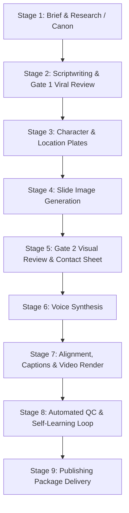

# StoryForge 🎬⚡

> **Autonomous AI Video Production Engine with Viral Retention Architecture & Multi-Slide Pacing.**  
> Create high-retention, publication-ready vertical Shorts / TikToks and landscape videos from idea to final `.mp4` in minutes.

[](https://www.python.org/)
[]()
[](LICENSE)
[]()

---

## 🌟 Highlights

- **🧠 Viral Retention Brain**: Built-in 10 Hook Archetypes, 3-Layer Hooks (Verbal + Visual + Text), *But/Therefore* causal escalation, Payoff delivery, and Seamless Looping for >100% completion rates.
- **⚡ Multi-Slide Visual Pacing (1-to-many)**: Dynamically cuts B-roll visuals every 2–3.5 seconds across continuous, natural narration lines without audio stutter or artificial pauses.
- **🎨 Full-Bleed Edge-to-Edge Visuals**: Prompt architecture optimized for edge-to-edge canvas coverage without letterboxing, frames, or unsightly lower-third box artifacts.
- **🎙️ Expressive Voice & Alignment**: Integrated with Kokoro TTS / VoiceStudio for natural multilingual voiceover with millisecond-exact word timing and silence detection.
- **💬 Karaoke-Bold Captions**: Generates styled `.ass` subtitles with animated word highlights, safe-zone margins, and collision prevention.
- **🚀 Apple Silicon Acceleration**: Automatic `h264_videotoolbox` hardware encoding (renders 60s 1080x1920 video in **~15 seconds**) with instant fallback to `libx264 -preset veryfast`.
- **🛡️ Automated QC & Self-Learning**: Rigorous gate checks (drift, silence, frames, resolution, collisions) paired with `sf_learn` that calibrates language-specific speaking rates over time.

---

## 🏗️ Architecture & Production Pipeline

StoryForge operates as a deterministic, human-in-the-loop autonomous pipeline divided into 9 stages:



### The 9 Stages Explained

| Stage | Script / Tool | Description |
|---|---|---|
| **1. Canon / Research** | `sf_validate.py` | Validates factual claims or fiction canon integrity. |
| **2. Script** | `sf-script` / Gate 1 | Crafts hook, *But/Therefore* spine, word budget, and seamless loops. |
| **3. Plates** | `sf_image.py` | Generates consistent character faces and environment anchors. |
| **4. Images** | `sf_image.py` | Renders full-bleed 9:16 or 16:9 scene illustrations (Local 4-bit MLX or API). |
| **5. Gate 2** | `sf_contact_sheet.py` | Generates visual grid (`out/contact_sheet.png`) for one-glance director sign-off. |
| **6. Voice** | `sf_voice.py` | Synthesizes line audio via VoiceStudio with character error rate (CER) validation. |
| **7. Render** | `sf_align.py`<br>`sf_captions.py`<br>`sf_render.py` | Produces exact word timestamps, Karaoke `.ass` captions, and hardware-accelerated `.mp4`. |
| **8. QC & Learn** | `sf_qc.py`<br>`sf_learn.py` | Verifies silence gaps, frame drift, and records empirical speaking rate per language. |
| **9. Package** | `sf-director` | Formats viral titles, hook descriptions, 3-5 hashtags, and pinned engagement comments. |

---

## 🚀 Quickstart

### 1. Prerequisites

- **Python**: `>= 3.11`
- **Package Manager**: [`uv`](https://docs.astral.sh/uv/) (recommended)
- **FFmpeg**: Must be compiled with `libass` and optionally `h264_videotoolbox` (standard in Homebrew on macOS):
  ```bash
  brew install ffmpeg uv
  ```
- **Voice Server** (Optional for voice generation): Local [VoiceStudio](http://localhost:3900) or compatible TTS endpoint.

### 2. Installation

Clone the repository and install dependencies:

```bash
git clone https://github.com/chauvanhieu/script-forge.git
cd script-forge
uv sync
```

Verify your setup by running the test suite:

```bash
uv run pytest
# 137 passed in ~20s
```

### 3. Producing Your First Video

#### Step A: Initialize Project
Create a project folder under `projects/<slug>/` containing `story.json` and `script.md`:

```bash
# Validate your project structure
uv run scripts/sf_validate.py projects/<slug>
```

#### Step B: Generate Visuals & Review
```bash
# Generate slide illustrations (using 4-bit local MLX generator)
SF_CONFIG=config/providers.local-image.yaml uv run scripts/sf_image.py projects/<slug>

# Build contact sheet for quick inspection
uv run scripts/sf_contact_sheet.py projects/<slug>
# Preview projects/<slug>/out/contact_sheet.png
```

#### Step C: Synthesize Voice & Render Video
```bash
# Synthesize narration lines
uv run scripts/sf_voice.py projects/<slug>

# Word alignment & Karaoke captions
uv run scripts/sf_align.py projects/<slug>
uv run scripts/sf_captions.py projects/<slug>

# Render high-performance video
uv run scripts/sf_render.py projects/<slug>
```

#### Step D: Run QC & Calibration
```bash
# Automated quality assurance
uv run scripts/sf_qc.py projects/<slug>

# Record execution metrics to the learning library
uv run scripts/sf_learn.py projects/<slug>
```

Your final video will be at:
`projects/<slug>/out/final.mp4`

---

## 📁 Repository Layout

```text
├── config/
│   ├── caption-styles/          # Typography and color schemes for captions (e.g. karaoke-bold)
│   ├── providers.yaml           # Default TTS and image provider configuration
│   └── providers.local-image.yaml # Local 4-bit MLX FLUX / SDXL configuration
├── docs/                        # Architecture specs, plans, and technical references
├── library/
│   ├── calibration.json         # Language speaking rate calibration (chars/sec)
│   ├── checks.md                # Lessons learned and automated anti-defect checks
│   ├── taste.md                 # Visual and narrative taste standards
│   └── runs/                    # Historical run telemetry and metrics
├── projects/                    # Production workspace (one subfolder per video)
├── schemas/
│   └── story.schema.json        # JSON Schema Draft 2020-12 validating all story data
├── scripts/
│   ├── sflib/                   # Core engine library (timeline, media, project state)
│   ├── sf_validate.py           # Schema & relational validator
│   ├── sf_image.py              # Visual asset generator
│   ├── sf_contact_sheet.py      # Gate 2 contact sheet builder
│   ├── sf_voice.py              # Speech synthesis runner
│   ├── sf_align.py              # Phoneme and word-level timestamp aligner
│   ├── sf_captions.py           # ASS caption builder (karaoke / plain)
│   ├── sf_render.py             # FFmpeg motion clip compositor & hardware encoder
│   ├── sf_qc.py                 # Multi-point video & audio quality control
│   └── sf_learn.py              # Continuous learning loop
├── tests/                       # Complete pytest suite (unit, media, pipeline)
└── tools/
    └── local-image/             # Apple Silicon MLX local image generator
```

---

## 🎯 Key Design Patterns

### 1. Multi-Slide Pacing (`1 Line → Multiple Visuals`)
In short-form content, holding a single static image for 8–10 seconds causes catastrophic drop-off. StoryForge allows multiple consecutive slides to share the same voice narration line:
```json
{
  "slides": [
    { "id": "S03", "line_ids": ["L003"], "visual": { "shot": "wide", "motion": "push_in" } },
    { "id": "S04", "line_ids": ["L003"], "visual": { "shot": "medium", "motion": "pan_right" } }
  ]
}
```
`sflib/timeline.py` automatically calculates the block duration and partitions frames evenly, cutting the visual after 2.5s while the narration flows smoothly without interruption.

### 2. Full-Bleed Vertical Prompts
To eliminate unwanted white frames or bottom placeholder boxes, prompts use explicit full-bleed guidelines:
```text
Full-bleed edge-to-edge vertical 9:16 composition, seamless illustration covering entire canvas from top to bottom, no borders, no bottom frames, no white boxes, no text banners, no split screen, no empty lower bars.
```

### 3. Apple Silicon Hardware Encoding
`scripts/sf_render.py` automatically checks for `h264_videotoolbox` support:
```python
clip_codec = ["-c:v", "h264_videotoolbox", "-b:v", "8000k"] if use_vt else ["-c:v", "libx264", "-preset", "veryfast", "-crf", "18"]
```
This enables sub-20s video renders directly on M-series MacBooks.

---

## 🧪 Testing

StoryForge maintains strict test discipline:
```bash
uv run pytest
```
Tests cover:
- Schema validation and cross-referencing (`test_sf_validate.py`)
- Timeline calculation and frame drift prevention (`test_timeline.py`)
- Audio trimming and silence detection (`test_media.py`, `test_sf_voice.py`)
- ASS subtitle rendering and word wrapping (`test_sf_captions.py`)
- End-to-end pipeline execution (`test_pipeline.py`)

---

## 📄 License

This project is licensed under the [MIT License](LICENSE).
