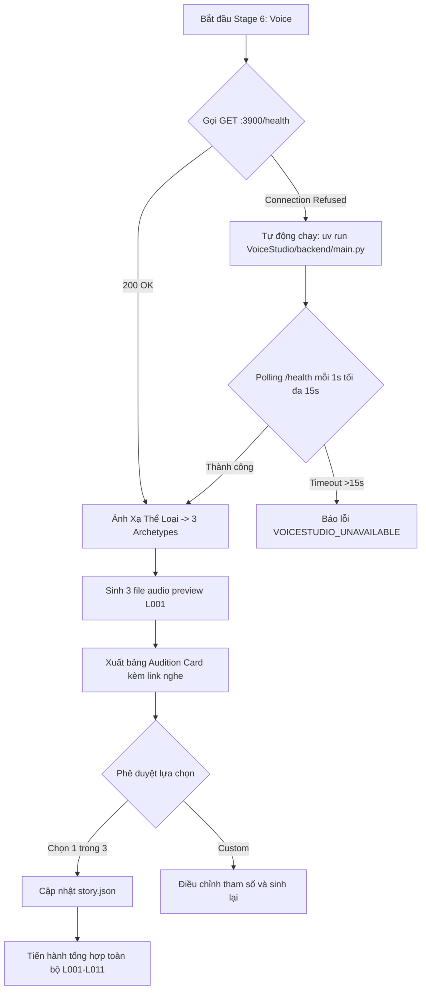

# Thiết Kế Chi Tiết: Skill Chọn Giọng Từ VoiceStudio (Voice Selection & Audition Gate)

> **Tài liệu đặc tả kiến trúc & quy trình thiết kế theo chuẩn Brainstorming**  
> **Ngày phê duyệt:** 2026-09-30  
> **Trạng thái:** Approved by User  
> **Mục tiêu:** Nâng cấp skill `sf-audio`, bổ sung quy trình tuyển chọn & nghe thử mẫu giọng (Audition Gate) đồng bộ với thể loại video và kết nối tự động với VoiceStudio.

---

## 1. Tóm Tắt Mục Tiêu (Understanding Summary)
* **Vấn đề cần giải quyết:** Giọng đọc trong video sản xuất tự động dễ bị lệch "vibe" so với nội dung (ví dụ: video khoa học bí ẩn nhưng giọng đọc bị đều, thiếu kịch tính, phong cách không phù hợp). Người dùng không có bước nghe thẩm định trước khi render cả video.
* **Sản phẩm:** Quy trình chọn giọng và thử giọng 2 giai đoạn (Casting Gate) cho StoryForge, kết nối trực tiếp với backend VoiceStudio cục bộ (port 3900).
* **Đối tượng phục vụ:** AI Director và nhà sáng tạo nội dung sản xuất video ngắn (Shorts / Reels / TikTok) trên StoryForge.
* **Nguyên tắc cốt lõi:**
  1. *Vibe-to-Archetype Mapping:* Tự động ánh xạ thể loại (`genre`, `content_type`) sang 3 ứng viên giọng tương phản rõ rệt.
  2. *Hook Audition Gate:* Chỉ sinh câu `L001` (Hook) cho 3 ứng viên để người dùng nghe thử và chốt trước khi tổng hợp toàn bộ video.
  3. *Auto-Service Launch:* Tự động kiểm tra và khởi động VoiceStudio nếu dịch vụ chưa chạy.
* **Phạm vi không làm (Non-goals):** Không dùng TTS đám mây ngoài VoiceStudio; không can thiệp logic dựng hình hay render video.

---

## 2. Các Giả Định (Assumptions)
1. Backend của VoiceStudio có thể khởi động độc lập qua CLI (`python VoiceStudio/backend/main.py`) trên cổng `3900`.
2. Dòng thoại `L001` luôn là mẫu thử chuẩn tốt nhất đại diện cho cảm xúc và nhịp điệu của toàn bộ video.
3. Các file audio preview lưu trữ tại `projects/<slug>/audio/previews/` để dễ truy xuất và nghe kiểm tra.

---

## 3. Sổ Ghi Nhận Quyết Định (Decision Log)

| Mã Quyết Định | Nội Dung Quyết Định | Các Phương Án Xem Xét | Lý Do Lựa Chọn |
| :--- | :--- | :--- | :--- |
| **DEC-01** | Công nghệ voice | Chỉ dùng VoiceStudio cục bộ | Tận dụng tài nguyên phần cứng, bảo mật và tuân thủ định hướng repo. |
| **DEC-02** | Phương thức thử giọng | Sinh 2–3 mẫu thử câu Hook (`L001`) | Tiết kiệm thời gian, thẩm định điểm chạm giữ chân người xem quan trọng nhất. |
| **DEC-03** | Tách pha Stage 6 | Chia thành 6A (Casting Gate) và 6B (Batch Synthesis) | Ngăn chặn việc tổng hợp hàng loạt khi chất giọng chưa được phê duyệt. |
| **DEC-04** | Khởi động tự động | Chạy qua script nền + health polling 15s | Đảm bảo tính liền mạch, không bắt người dùng thao tác thủ công ngoài terminal. |
| **DEC-05** | Phân loại Archetypes | Chuẩn hóa 3 cụm thể loại, mỗi thể loại có 3 ứng viên tương phản | Đủ phong phú để bao quát mọi chủ đề mà không làm rối người dùng. |
| **DEC-06** | Tốc độ sinh preview | Giới hạn chỉ render `L001` (< 5s cho cả 3 ứng viên) | Phản hồi tức thì, trải nghiệm tương tác nhanh gọn. |
| **DEC-07** | Cơ chế lưu trữ | Ghi đè vào `story.json` + tùy chọn lưu vào `library/cast/` | Đảm bảo tính nhất quán và cho phép tái sử dụng cho các video sau. |
| **DEC-08** | Xử lý phát âm từ | Tích hợp bộ quy đổi `[[written\|spoken]]` cho từ viết tắt/số | Ngăn ngừa lỗi phát âm sai tiếng Việt từ bước thử giọng. |
| **DEC-09** | Tùy biến linh hoạt | Hỗ trợ lệnh `/sf-cast custom` điều chỉnh pitch/speed | Cho phép tinh chỉnh nếu cả 3 mẫu mặc định chưa vừa ý. |

---

## 4. Thiết Kế Chi Tiết Đã Được Phê Duyệt (Approved Design)

### 4.1. Kiến Trúc Khởi Động & Kiểm Tra Dịch Vụ (Auto-Service Launch)


### 4.2. Bảng Danh Mục Ánh Xạ Thể Loại (Vibe-to-Archetype Taxonomy)

1. **Cụm 1: Khoa học / Khám phá / Bí ẩn (Factual / Science / Mystery)**
   - *Ứng viên 1 (Mặc định):* Nam trầm bí ẩn (`male, 30s, low pitch, deep resonance, calm and enigmatic`).
   - *Ứng viên 2:* Nam đĩnh đạc tài liệu (`male, young adult, moderate pitch, crisp, authoritative`).
   - *Ứng viên 3:* Nữ thông tuệ truyền cảm (`female, 20s-30s, moderate-low pitch, warm, reflective`).
2. **Cụm 2: Kinh tế ngầm / Bóc phốt công nghệ (Hidden Economics / Consumer Tech)**
   - *Ứng viên 1 (Mặc định):* Nam sắc sảo, cảnh báo (`male, young adult, moderate pitch, alert, investigative`).
   - *Ứng viên 2:* Nữ phản biện dứt khoát (`female, adult, moderate pitch, firm, articulate`).
   - *Ứng viên 3:* Nam phân tích sâu sắc (`male, middle-aged, low pitch, composed, analytical`).
3. **Cụm 3: Tâm lý / Cảm xúc / Xã hội (Drama / Social / Storytelling)**
   - *Ứng viên 1 (Mặc định):* Nam tự sự ấm áp (`male, 20s, moderate-low pitch, gentle, heartfelt`).
   - *Ứng viên 2:* Nữ truyền cảm sâu sắc (`female, 20s, warm, heartfelt, expressive`).
   - *Ứng viên 3:* Nữ trung niên uy nghiêm (`female, middle-aged, stern, mature, authoritative`).

### 4.3. Cấu Trúc File & Dữ Liệu
* **File preview:** `projects/<slug>/audio/previews/`
  * `opt1_nam_tram.wav`
  * `opt2_nam_dinhdac.wav`
  * `opt3_nu_truyencam.wav`
* **Ghi nhận vào `story.json`:**
  ```json
  "cast": [
    {
      "id": "narrator",
      "name": "Người kể",
      "role": "narrator",
      "voice": {
        "source": "design",
        "profile_id": "<profile_id_tu_voicestudio>",
        "design_prompt": "male, 30s, low pitch, deep resonance",
        "instruct": "male, 30s, low pitch, deep resonance",
        "selected_option": "opt1_nam_tram"
      }
    }
  ]
  ```

---

## 5. Kế Hoạch Triển Khai (Next Steps)
1. **Module hóa công cụ:** Tạo script `scripts/sf_audition.py` thực hiện việc auto-launch, vibe mapping và preview generation.
2. **Nâng cấp skill:** Cập nhật nội dung `.agents/skills/sf-audio/SKILL.md` theo quy trình Audition Gate mới.
3. **Thực thi thử nghiệm:** Áp dụng ngay cơ chế này vào dự án `projects/ao-giac-80-mili-giay` để nghe thử 3 mẫu giọng và thay thế giọng đọc chưa ưng ý của video hiện tại.
